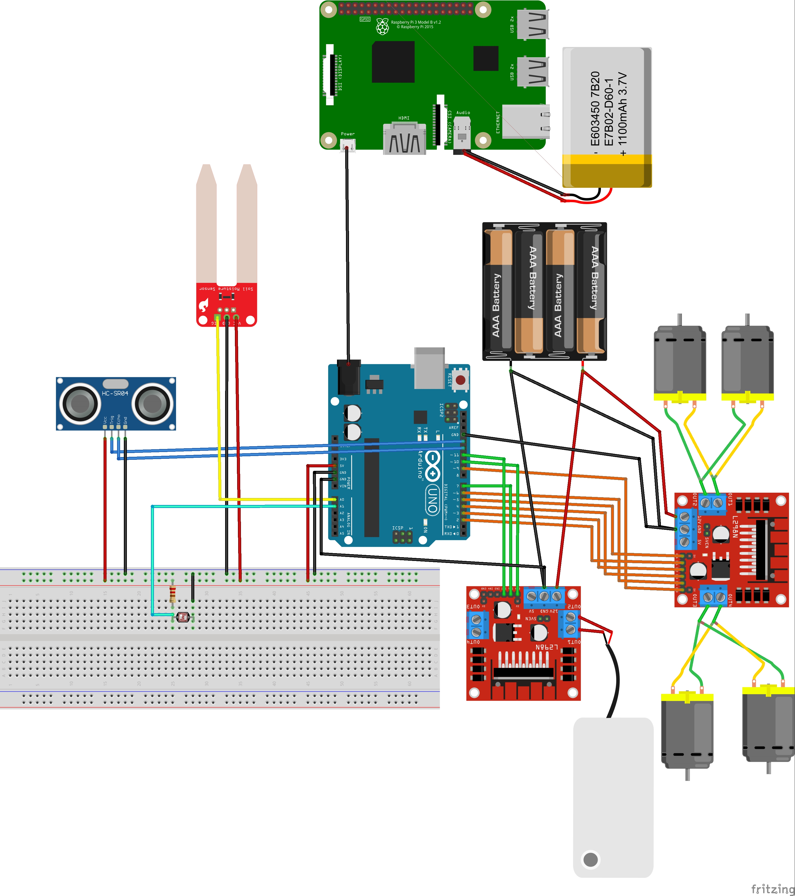
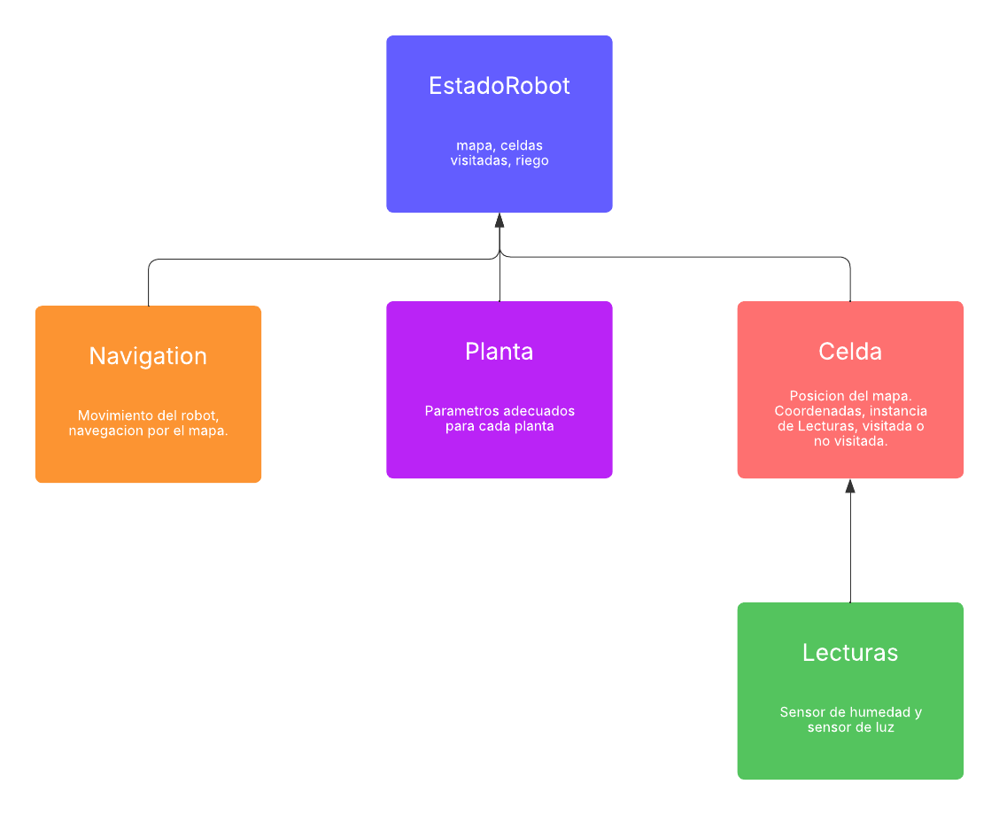

# 🧠 PCARE - RLP Project


## 🧭 Table of Contents

1. Project Description
2. Demo
3. Components
4. Hardware Scheme
5. Software Scheme
6. How to Use
7. Amazing Contributions
8. 3D Model
9. Software Requirements
10. Support
11. Bibliography

## 📘 Project Description

**"Cuidar tus plantas, incluso cuando no estás."**

Sistema robótico autónomo diseñado para el mantenimiento de una planta sin supervisión directa. Es capaz de desplazarse de forma inteligente dentro del espacio para posicionarse en la zona con mejor iluminación. Incorpora sensores de humedad para monitorizar el estado de la tierra y activar un sistema de riego automático cuando sea necesario. Funciona con batería recargable y realiza un seguimiento continuo de las condiciones ambientales que rodean a la planta.
Está pensado para personas que desean mantener sus plantas saludables sin preocuparse por los cuidados diarios. Su diseño compacto, móvil y autónomo lo hace especialmente útil en entornos interiores sin acceso constante a luz natural o riego manual.


## 🎥 Demo

[Ver video en Google Drive](https://drive.google.com/file/d/1RFXhxHZZ7uanfg3AD7WiqcH8D6Dph1f0/view?usp=sharing)


## 🔩 Components

| <div align="center">Componente</div> | <div align="center">Imagen</div> | <div align="center">Enlace de Compra</div> |
|--------------------------------------|----------------------------------|---------------------------------------------|
| Sensor de humedad del suelo          |  | [Comprar](https://tienda.bricogeek.com/sensores-humedad/651-sensor-de-humedad-del-suelo.html) |
| Micro bomba de agua con tubo         |  | [Comprar](https://tienda.bricogeek.com/motores-dc/1611-micro-bomba-de-agua-con-tubo.html) |
| Sensor lumínico                      |  | [Comprar](https://tienda.bricogeek.com/sensores-luz-infrarrojos/1317-sensor-de-luz-ambiente-hw5p-1.html) |
| Sensor de ultrasonido                |  | [Comprar](https://tienda.bricogeek.com/sensores-distancia/741-sensor-de-distancia-por-ultrasonidos-hc-sr04.html) |
| Panel solar                          |  | [Comprar](https://tienda.bricogeek.com/placas-solares/1445-panel-solar-5v-1a-con-usb.html) |
| Cargador LiPo                        |  | [Comprar](https://tienda.bricogeek.com/convertidores-de-voltaje/677-cargador-lipo-powerboost-500.html) |
| Batería LiPo 2200 mAh                |  | [Comprar](https://tienda.bricogeek.com/baterias-lipo/1925-bateria-lipo-2200mah-37v-903759.html) |
| Tarjeta microSD 128 GB               |  | [Comprar](https://tienda.bricogeek.com/accesorios-raspberry-pi/1760-memoria-microsd-kingston-128gb-clase-10-740617298703.html) |
| Raspberry Pi 4 (4 GB)                |  | [Comprar](https://tienda.bricogeek.com/placas-raspberry-pi/1330-raspberry-pi-4-model-b-4-gb.html) |
| Cámara Raspberry Pi V2 (8 MP)        |  | [Comprar](https://tienda.bricogeek.com/accesorios-raspberry-pi/822-camara-raspberry-pi-v2-8-megapixels.html) |
| Arduino Nano Every                   |  | [Comprar](https://tienda.bricogeek.com/arduino-original/1433-arduino-nano-every.html) |
| Controlador de motores L298 (x2) |  | [Comprar](https://tienda.bricogeek.com/motores/285-controlador-de-motores-doble-puente-h-l298.html) |
| Servomotor rotación continua (x4)|  | [Comprar](https://tienda.bricogeek.com/motores/118-servomotor-de-rotacion-continua-s3003-360-grados.html) |

## 🛠️ Hardware Scheme




## 💻 Software Scheme



## 🚀 How to Use

### 1. Instalación en Raspberry Pi 4B

* Instalar Raspbian OS (o distro Linux compatible).
* Instalar ORB-SLAM2.
* Instalar ORB-SLAM2 Python Bindings.

### 2. Programar Arduino

* Cargar `/code/arduino/robot_controller.ino` en Arduino con el IDE.

### 3. Conectar hardware

* Seguir el esquema Fritzing para las conexiones físicas.

---

### 4. Preparar entorno y clonar repositorio

```bash
git clone https://github.com/usuario/PCARE-RLP.git
cd PCARE-RLP
pip install -r requirements.txt
```

---

### 5. Configurar el script `main.py` para ejecución automática con cron

* Asegúrate que `main.py` tenga permisos de ejecución:

```bash
chmod +x /home/usuario/PCARE-RLP/code/robot/main.py
```

* Edita el crontab para ejecutar `main.py` diariamente a las 5:15 am:

```bash
crontab -e
```

* Añade esta línea (ajusta la ruta a Python y al script si es necesario):

```
15 5 * * * /usr/bin/python3 /home/usuario/PCARE-RLP/code/robot/main.py >> /home/usuario/PCARE-RLP/code/robot/main.log 2>&1
```

---

### 6. Ejecutar manualmente (opcional)

```bash
cd /home/usuario/PCARE-RLP/code/robot
python3 main.py
```

---

### 7. Configurar URL backend en Vue.js

* Copia la URL generada por ngrok en la función `getBaseUrl()` en:

```
code/app/vue-project-template/src/assets/functions.js
```

* Modifica así:

```js
function getBaseUrl() {
    return localStorage.getItem('BASE_URL') || "http://tu-url-ngrok.ngrok.io";
}
```


### 8. Preparar y ejecutar frontend en ordenador controlador

En tu ordenador controlador, navega a la carpeta del frontend:

```bash
cd /ruta/a/PCARE-RLP/code/app/vue-project-template
npm install
npm run dev
```

Esto levantará el servidor de desarrollo Vue.js.

## 🌟 Amazing Contributions

TODO

## 🧱 3D Model
* Archivos STL ubicados en la carpeta `Designs`:

  * [Base.stl](./Designs/Base.stl)
  * [Maceta.stl](./Designs/Maceta.stl)
  * [Recipiente.stl](./Designs/Recipiente.stl)


## 💾 Software Requirements

* Python 3.10+ ([Descargar](https://www.python.org/))
* Visual Studio Code ([Descargar](https://code.visualstudio.com/))
* Conda / Miniconda ([Descargar](https://docs.conda.io/en/latest/miniconda.html))
* ORB-SLAM2 ([Repositorio](https://github.com/raulmur/ORB_SLAM2))
* ORB-SLAM2 Python Bindings ([Repositorio](https://github.com/GiordanoLaminetti/ORB_SLAM2-PythonBindings/tree/master))
* pyboostcvconverter ([Repositorio](https://github.com/Algomorph/pyboostcvconverter/tree/master))
* Fritzing ([Descargar](https://fritzing.org/download/))
* Vue.js ([Documentación oficial](https://vuejs.org/))
* Arduino IDE ([Descargar](https://www.arduino.cc/en/software))


## 🏫 Support
* Escola d’Enginyeria UAB
* OpenLabs

## 📚 Bibliography

* Repositorios de referencia:
* https://github.com/weixr18/Pi-SLAM/tree/main?tab=readme-ov-file
* https://github.com/RubenRS040398/librobot?tab=readme-ov-file
* Usar IEEE
* Artículos, manuales y documentación oficial de los paquetes utilizados.

